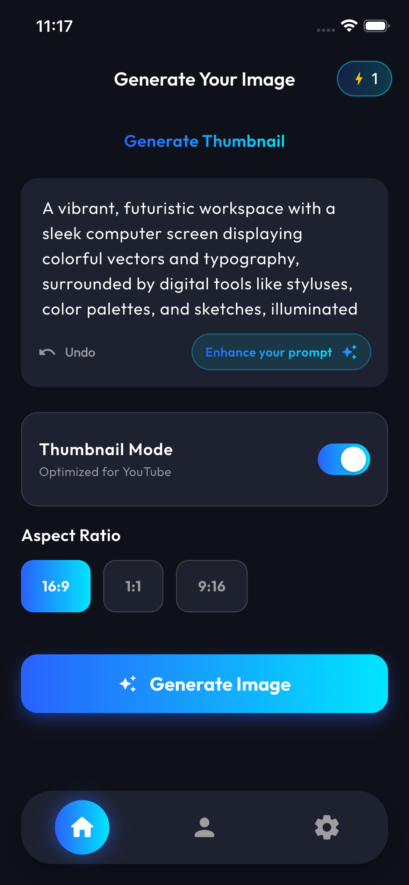
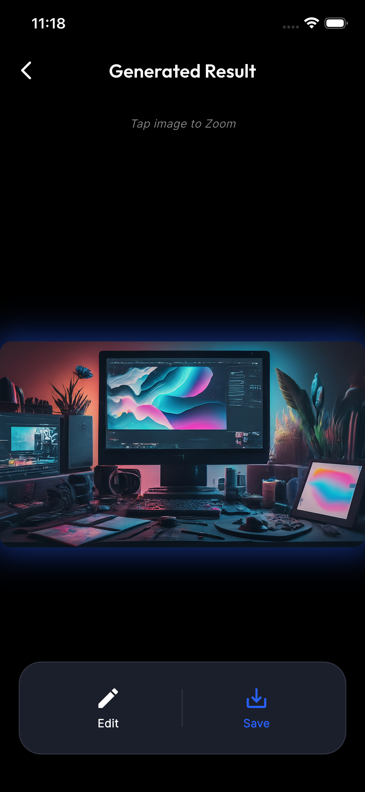
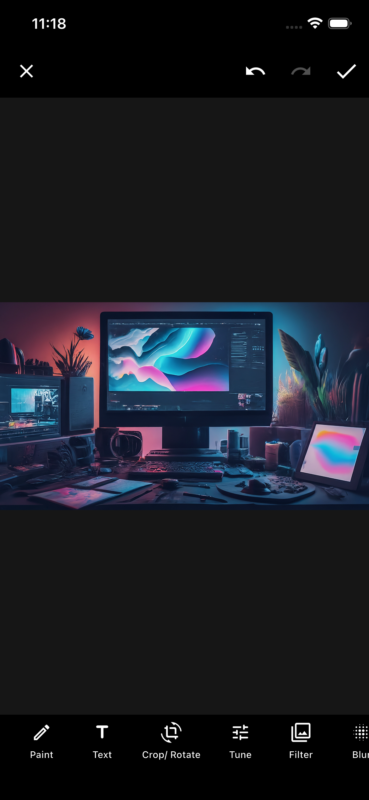
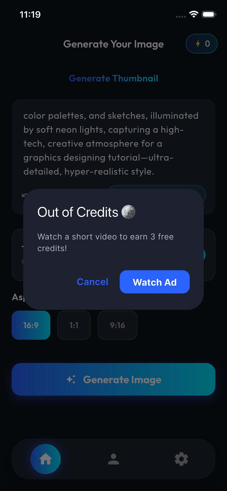
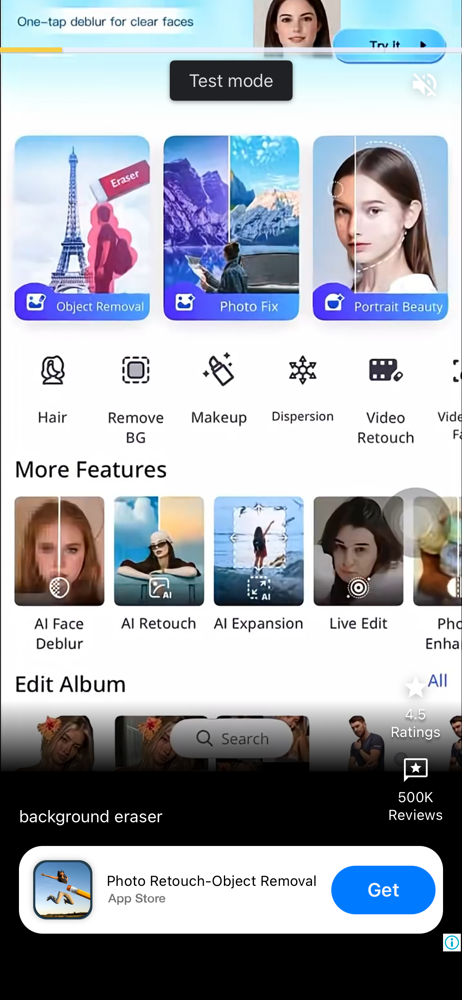
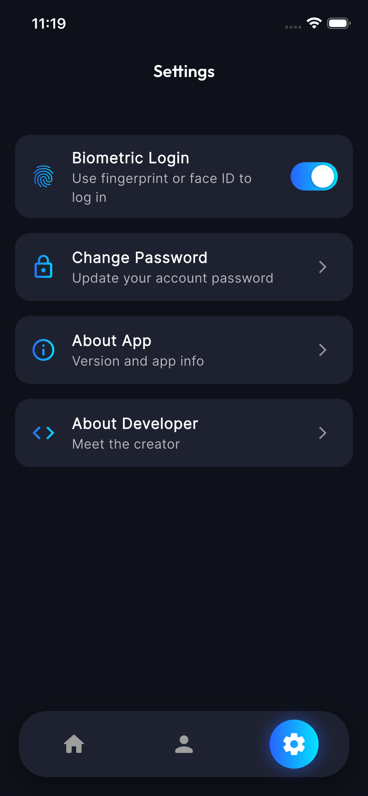

# 🎨 AI Thumbnail Maker

A powerful Flutter application that leverages Google's Vertex AI (Imagen 2) and Gemini API to generate viral YouTube thumbnails instantly. Create stunning, high-quality thumbnails from simple text prompts.

## ✨ Features

- **🤖 AI-Powered Generation:** Generate high-quality images using Google's state-of-the-art Imagen 2 model.
- **✨ Prompt Enhancement:** Automatically enhance your simple prompts into detailed descriptions using Gemini API.
- **📐 Multiple Aspect Ratios:** Support for various aspect ratios (16:9 for YouTube, 1:1 for Instagram, etc.).
- **🔐 Secure Authentication:**
  - Email/Password Login & Sign Up.
  - Google Sign-In.
  - **Biometric Login** (Fingerprint/Face ID) for quick access.
- **🎨 Modern UI/UX:**
  - Beautiful Dark Theme with Gradient accents.
  - Smooth animations and transitions.
  - Custom "Italianno" fonts and "Outfit" typography.
- **💾 History & Downloads:** Save your generated thumbnails and download them directly to your gallery.

## 📱 Screenshots

|                                                     Login & Auth                                                     |                                                      Home & Generation                                                       |
| :------------------------------------------------------------------------------------------------------------------: | :--------------------------------------------------------------------------------------------------------------------------: |
|   |   |

|                                                Results & Ads                                                 |                                                        Settings                                                         |
| :----------------------------------------------------------------------------------------------------------: | :---------------------------------------------------------------------------------------------------------------------: |
|   |   |

## 🛠️ Tech Stack

- **Framework:** [Flutter](https://flutter.dev/)
- **Language:** Dart
- **Backend:** [Firebase](https://firebase.google.com/) (Auth, Firestore)
- **AI Models:**
  - **Image Generation:** Vertex AI (Imagen 2)
  - **Text Enhancement:** Gemini API / Pollinations AI
- **State Management:** Provider
- **Ads:** Google Mobile Ads (AdMob)

## 🚀 Getting Started

### Prerequisites

- Flutter SDK installed.
- Firebase project set up.
- Google Cloud Project with Vertex AI API enabled.

### Installation

1.  **Clone the repository:**

    ```bash
    git clone https://github.com/arslandev97/flutter-ai-thumbnail-maker.git
    cd flutter-ai-thumbnail-maker
    ```

2.  **Install dependencies:**

    ```bash
    flutter pub get
    ```

3.  **Set up Environment Variables:**
    Create a `.env` file in the root directory and add your API keys:

    ```env
    GEMINI_API_KEY=your_gemini_api_key_here
    HUGGING_FACE_API_KEY=your_vertex_ai_key_here
    ```

4.  **Firebase Configuration:**

    - Ensure you have `google-services.json` (Android) and `GoogleService-Info.plist` (iOS) placed in their respective directories.

5.  **Run the App:**
    ```bash
    flutter run
    ```

## 🤝 Contribution

Contributions are welcome! Please feel free to submit a Pull Request.

1.  Fork the Project
2.  Create your Feature Branch (`git checkout -b feature/AmazingFeature`)
3.  Commit your Changes (`git commit -m 'Add some AmazingFeature'`)
4.  Push to the Branch (`git push origin feature/AmazingFeature`)
5.  Open a Pull Request

## 📄 License

This project is licensed under the MIT License - see the [LICENSE](LICENSE) file for details.

---

Made with ❤️ by [Arslan](https://github.com/arslandev97)
